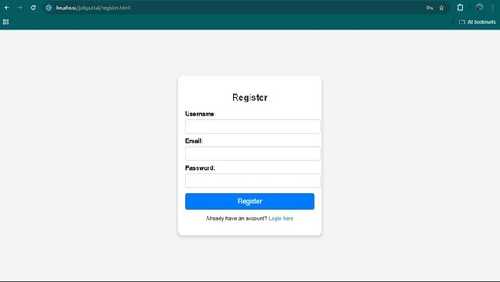
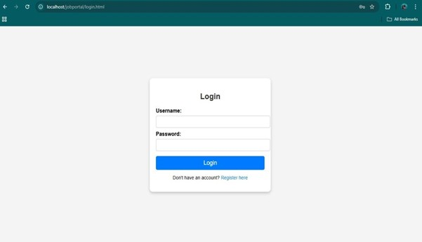
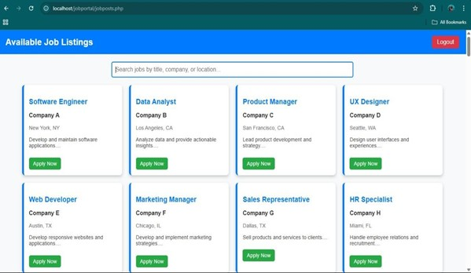
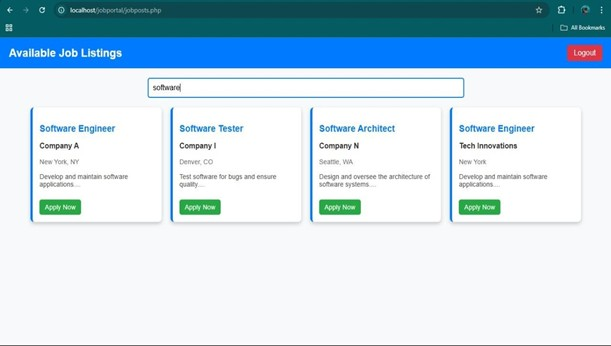
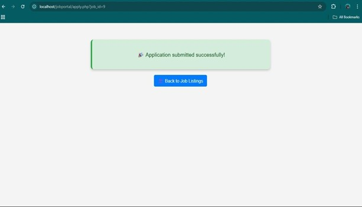
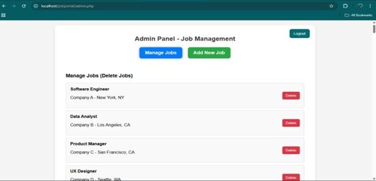

<div align="center">

# 💼 Job Portal

### A Web-Based Recruitment Platform built with PHP & MySQL


> A dynamic and user-friendly Job Portal that bridges the gap between **Job Seekers** and **Employers** — built as a Micro Project for the course *Web Based Application Development Using PHP (22619)*.

</div>

---

## 📸 Screenshots

<div align="center">

### 🏠 Home Page


### 📝 Register Page


### 🔐 Login Page


### 📋 Available Job Listings


### 🔍 Search Jobs


### ✅ Application Submitted


### 🛠️ Admin Panel – Manage Jobs


### ➕ Admin Panel – Add New Job


</div>

---

## 📌 About The Project

The **Job Portal** is a full-stack web application designed to simplify and modernize the job recruitment process. It provides a seamless experience for job seekers to browse and apply for jobs, while giving administrators full control over job listings.

Traditional recruitment methods are becoming outdated — this platform offers an online solution that is fast, secure, and scalable.

---

## ✨ Features

| Feature | Description |
|--------|-------------|
| 👤 User Registration & Login | Secure authentication for job seekers |
| 🔍 Job Search | Search jobs by title, company, or location |
| 📄 Job Listings | Browse all available job openings |
| 📨 Apply for Jobs | One-click job application submission |
| 🛡️ Admin Panel | Admins can add, manage, and delete job posts |
| 🔒 Secure | SQL injection prevention & encrypted credentials |

---

## 🗂️ Project Structure
```
jobportal/
│
├── index.html              # Landing page
├── register.html           # User registration
├── login.html              # User login
├── jobposts.php            # Job listings page
├── apply.php               # Job application handler
├── admin_login.html        # Admin login page
├── admin.php               # Admin panel
├── db_connect.php          # Database connection
└── screenshots/            # Project screenshots
```

---

## 🛠️ Tech Stack

- **Frontend:** HTML5, CSS3, JavaScript
- **Backend:** PHP (Server-side scripting)
- **Database:** MySQL
- **Tools:** Notepad, XAMPP / localhost, phpMyAdmin

---

## ⚙️ Getting Started

### Prerequisites
- XAMPP or any local server with PHP & MySQL support
- A browser (Chrome, Firefox, etc.)

### Installation
```bash
# 1. Clone the repository
git clone https://github.com/your-username/jobportal.git

# 2. Move to your server's root directory
#    (e.g., htdocs for XAMPP)
cp -r jobportal/ /path/to/htdocs/

# 3. Import the database
#    Open phpMyAdmin → Create DB 'jobportal' → Import jobportal.sql

# 4. Configure DB connection in db_connect.php
$host = "localhost";
$user = "root";
$password = "";
$database = "jobportal";

# 5. Start Apache & MySQL from XAMPP Control Panel

# 6. Visit in browser
http://localhost/jobportal/index.html
```

---

## 👥 Team

| Roll No. | Name |
|----------|------|
| 40 | Bawage Sphurti Sanjaykumar |
| 41 | Patil Abhishek Vitthal |
| 42 | Patil Dhanashree Shashikant |

> **Guide:** Mr. M. A. Pilankar, Senior Lecturer — Computer Engineering

---

## 🏫 Institution

**Shree Mouni Vidhyapeeth's**  
Institute of Civil and Rural Engineering, Gargoti  
*Diploma in Computer Engineering — Academic Year 2024–25*  
Maharashtra State Board of Technical Education

---

## 📚 References

- 📖 Manual: Web Based Application Development Using PHP (22619)
- 🌐 [W3Schools PHP Documentation](https://www.w3schools.com/php/)

---

## 📃 License

This project was developed for academic purposes under MSBTE guidelines.

---

<div align="center">
  Made with ❤️ by <b>Abhishek, Sphurti & Dhanashree</b> | © 2025 Job Portal
</div>
